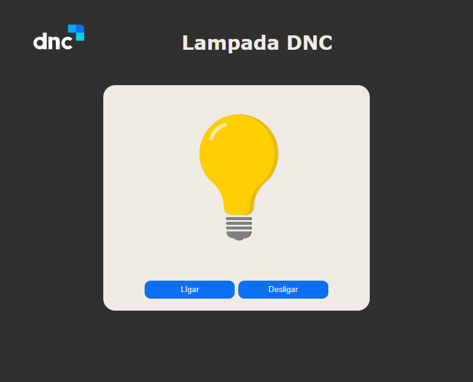

# DNC School

## Escola DNC Ciclo Iniciante
## Conhecendo o DOM

> Formação em Tecnologia

Projeto de uma Lampada.

> [🔗 Clique aqui para acessar da Page]()

# 🧰🛠️ Tecnologias

- HTML
- CSS
- Git e Github
- Variavéis
- WEB
- Function
- JavaScript

# 💛 Contato

sebastiaovitor18@gmail.com

[Linkedin](https://www.linkedin.com/in/sebastião-vitor-7a2870106/)
=======

Nessa etapa usamos de exeplo uma lampada para aprender a dar os primeiros passo no DOM.

Ansioso para as próximas etapas.
😁bora codar.
